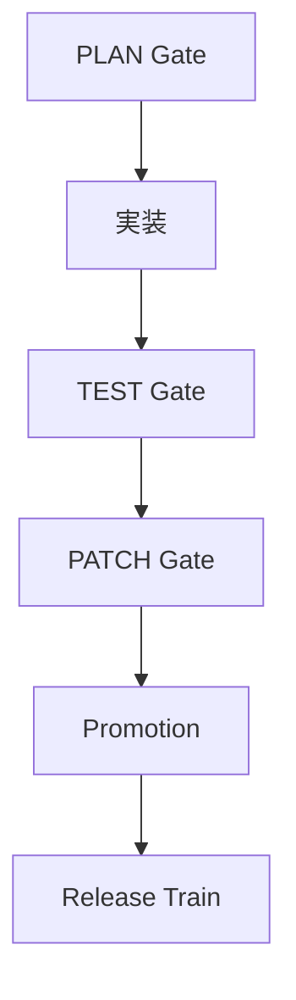

# Project Rules - MOC

## 📋 ルール一覧

| No | Rule Name | 概要 | 適用レベル | 詳細 |
|---|---|---|---|---|
| 1 | EOL Rule | 改行コード統一 | ✅ Always Apply | **LF固定**、例外: `*.bat`のみ**CRLF**（`*.ps1`もLF） |
| 2 | Python Rule | Python標準 | ✅ Always Apply | Black+isort、ログ保存先: `data/logs/current/` |
| 3 | PowerShell Rule | PowerShell標準 | ✅ Always Apply | **Dry-Run既定**、書込は`-Apply`のみ |
| 4 | MyPy Rule | 型チェック | ⚠️ Best Effort | `src/`のみ対象、エラーでも継続 |
| 5 | Backup Rule | バックアップ | ✅ Always Apply | 変更前に`backups/`へ自動保存 |
| 6 | Security Rule | セキュリティ | ✅ Always Apply | 秘匿情報の除外・暗号化 |
| 7 | Format Rule | フォーマット | ✅ Always Apply | `.editorconfig`準拠 |
| 8 | Venv Rule | 仮想環境 | ✅ Always Apply | `.venv`使用、requirements.txt管理 |
| 9 | Guard Rule | 保護機能 | ✅ Always Apply | 重要ファイルの変更制限 |
| 10 | No Self-Mod Rule | 自己変更禁止 | ✅ Always Apply | 例外: AutoPatch Mode |
| 11 | Patch Diff Rule | パッチ差分 | ✅ Always Apply | 変更内容の明示・検証 |
| 12 | Checkpoint Rule | チェックポイント | ✅ Always Apply | 段階的な進捗保存 |
| 13 | PLAN Gate | 計画ゲート | ✅ Always Apply | 実装前の設計検証 |
| 14 | TEST Gate | テストゲート | ✅ Always Apply | 品質基準の確認 |
| 15 | PATCH Gate | パッチゲート | ✅ Always Apply | 変更内容の最終検証 |
| 16 | Test Layout | テスト整理 | ✅ Always Apply | 階層・命名・決定化ルール |
| 17 | Test Artifacts | テスト成果物 | ✅ Always Apply | coverage/junit出力管理 |
| 18 | External Assets | 外部資産除外 | ✅ Always Apply | `llama.cpp/`等の除外 |
| 19 | CODEOWNERS | コード所有者 | ✅ Always Apply | `.github/CODEOWNERS`必須 |
| 20 | Pre-push Test | 送信前検証 | ✅ Always Apply | `pytest`+coverage閾値をpre-push |
| 20a | Hooks Path | Gitフック配置 | ✅ Always Apply | `git config core.hooksPath scripts/hooks` を既定化 |
| 21 | SBOM | ソフトウェア部品表 | ✅ Always Apply | `observability/sbom/`で管理 |
| 22 | Release Train | リリース列車 | ✅ Always Apply | 段階的リリース管理 |
| 23 | Feature Flag | 機能フラグ | ✅ Always Apply | 段階的機能展開 |

## 🔄 開発プロセス概要



## 🤝 バイブコーディング運用ルール

### 基本方針
- **Always Apply**: 必須適用（例外なし）
- **Best Effort**: 最善努力（エラーでも継続）
- **Dry-Run既定**: 実行前に計画表示、`-Apply`で実行

### AutoPatch Mode
- 自己変更禁止の例外として、品質向上のための自動パッチ適用を許可
- 事前テスト必須、ロールバック機能付き

## 🚀 Autostart Mode（自動起動・監視）

- 目的: バイブコーディングの自律運転（計画→生成→検証→昇格）
- 起動: `scripts/trae_autostart.ps1` を**15分間隔**で実行（タスクスケジューラ）
- 予算: **CPU 15分/回**、**メモリ 2GB**、**ディスク 100MB/回**
- ロック: `data/locks/autopatch.lock`取得不可なら即終了
- 出力: `data/logs/current/trae_autostart_*.log`
- キルスイッチ: `.trae/disable_autostart` or `TRAE_AUTOSTART=0`
- バックオフ: 直近3runで失敗orロック衝突→**30/60/120分**に自動拡張
- ヘルス: `CPU>85%` or `FreeSpace<10%` → 実行**スキップ**（次回へ）

## 🏪 ストア出荷ルール

### 提出物管理
- 場所: `store/` ディレクトリ
- 構成: アプリケーション本体、メタデータ、証明書
- 検証: 自動テスト、セキュリティスキャン必須

## 🔐 秘匿・署名鍵ポリシー

### 秘匿情報管理
- API キー、パスワード等は環境変数またはキーボルトで管理
- ソースコードに直接記載禁止
- `.env` ファイルは `.gitignore` に追加

### 署名鍵管理
- コード署名用の証明書は安全な場所に保管
- 自動ビルド時の署名プロセスを確立

## 📊 テレメトリ・監視標準

### 監視項目
- アプリケーション性能メトリクス
- エラー率、レスポンス時間
- リソース使用量（CPU、メモリ、ディスク）

### データ保存
- 場所: `observability/` ディレクトリ
- 形式: JSON、CSV、XML対応
- 保持期間: 30日間

## ⚖️ コンプライアンス・法務ゲート

### ライセンス管理
- オープンソースライセンスの適切な表示
- 商用ライセンスの条件遵守
- SBOM（Software Bill of Materials）の生成・管理

### プライバシー保護
- 個人情報の適切な取り扱い
- データ保護規制（GDPR等）への対応

## 🌐 ローカライズ/アクセシビリティ/性能

### ローカライズ
- 多言語対応の準備（i18n）
- 文字エンコーディングの統一（UTF-8）

### アクセシビリティ
- WCAG 2.1 AA準拠
- キーボードナビゲーション対応

### 性能
- レスポンス時間の目標設定
- メモリ使用量の最適化

## 🔧 技術的ルール

### Test Layout
- **階層**: `tests/unit/`, `tests/integration/`, `tests/e2e/`
- **命名**: `test_*.py`, `*_test.py`
- **決定化**: ランダム要素の排除、固定シード使用

### Test Artifacts
- **Coverage**: XML形式で `observability/coverage/coverage.xml`
- **JUnit**: XML形式で `observability/junit/junit.xml`

### Autostart Rule
- 起動条件: テスト差分検知、スケジュール実行
- 実行制限: リソース監視、ロック機構

### Lock/Budget Rule
- ロックファイル: `data/locks/*.lock`
- 予算管理: CPU時間、メモリ、ディスク使用量

### Kill-Switch Rule
- 緊急停止: `.trae/disable_autostart` ファイル作成
- 環境変数: `TRAE_AUTOSTART=0`

### External Assets Rule
- 除外対象: `llama.cpp/`, `node_modules/`, `*.exe`, `*.dll`
- 管理方法: `.gitignore`, 別途ダウンロード

### MyPy Range Rule
- 対象: `src/` ディレクトリのみ
- 設定: `mypy.ini` で詳細設定
- エラー処理: 警告表示、継続実行

### Pre-push Test Rule
- 実行内容: `pytest` + coverage閾値チェック
- 失敗時: push拒否、修正要求

## 🧾 pytest / coverage 設定

### pytest.ini
```ini
[tool:pytest]
testpaths = tests
python_files = test_*.py *_test.py
python_classes = Test*
python_functions = test_*
addopts = --strict-markers --strict-config
markers =
    unit: Unit tests
    integration: Integration tests
    e2e: End-to-end tests
    slow: Slow running tests
```

### .coveragerc
```ini
[run]
source = src
omit = 
    */tests/*
    */venv/*
    */__pycache__/*

[report]
fail_under = 80
precision = 1
```

## 🏗️ マイルストーン管理ルール

### マイルストーン定義
- **Alpha**: 基本機能実装完了
- **Beta**: 品質検証完了
- **RC**: リリース候補版
- **GA**: 一般提供開始

### 昇格条件
- 全テストパス
- コードレビュー完了
- セキュリティチェック完了

## 📱 アプリ開発ワークフロー


## 📁 ディレクトリ構造推奨

```
project/
├── .trae/rules/          # プロジェクトルール
├── .github/              # GitHub設定
│   ├── workflows/        # CI/CDワークフロー
│   └── CODEOWNERS        # コード所有者定義
├── src/                  # ソースコード
├── tests/                # テストコード
│   ├── unit/            # ユニットテスト
│   ├── integration/     # 統合テスト
│   └── e2e/             # E2Eテスト
├── data/                 # データファイル
│   ├── logs/            # ログファイル
│   │   ├── current/     # 現在のログ
│   │   └── legacy/      # 過去のログ
│   └── locks/           # ロックファイル
├── observability/        # 監視・観測データ
│   ├── coverage/        # カバレッジレポート
│   ├── junit/           # JUnitレポート
│   └── sbom/            # ソフトウェア部品表
├── store/               # ストア提出物
├── scripts/             # スクリプト
│   └── hooks/           # Gitフック
├── backups/             # バックアップ
└── requirements.txt     # 依存関係
```

## 📝 更新履歴

- 2024-01-XX: 初版作成
- 2024-01-XX: テスト整理ルール追加
- 2024-01-XX: pytest/coverage設定詳細化
- 2024-01-XX: ゲートチェック（PLAN/TEST/PATCH）新設
- 2024-01-XX: 外部資産除外ルール追加
- 2024-01-XX: MyPy範囲ルール追加
- 2024-01-XX: Autostart Mode詳細化（予算・ロック・キルスイッチ）
- 2024-01-XX: EOL強制化、Hooks Path、バックオフ・ヘルス機能追加