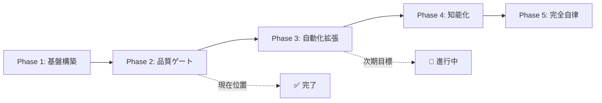

# ORCHESTRATION_ROADMAP.md - オーケストレーション実現ロードマップ

## 🎯 最終目標
**完全自律型オーケストレーション**: 人間の介入なしに品質ゲートを通過し、継続的にシステムを改善・進化させる自律システムの実現

## 📍 現在位置: **Phase 2 完了** (2025-10-06)



## 🏗️ マイルストーン詳細

### ✅ Phase 1: 基盤構築 (完了)
**期間**: 2025-09-XX ～ 2025-10-05  
**目標**: 品質管理の基礎インフラ構築

#### 達成項目
- [x] プロジェクト構造標準化
- [x] ルール体系確立 (PROJECT_RULES.md)
- [x] 開発環境整備 (.venv, requirements.txt)
- [x] 基本テストフレームワーク (pytest)

---

### ✅ Phase 2: 品質ゲート構築 (完了)
**期間**: 2025-10-06 08:00 ～ 2025-10-06 18:15  
**目標**: PTP (Plan→Test→Patch) 品質ゲート実装

#### 達成項目
- [x] **タスク管理システム** (TASKS.md)
  - 状態機械: PLAN→READY→DOING→REVIEW→DONE
  - ロック機構・TTL管理
  - 所有者管理 (CMD/WORK/AUDIT)

- [x] **承認ゲートシステム** (APPROVALS.md)  
  - 承認フロー: pending→approved/rejected
  - 証跡管理・監査ログ
  - 権限分離 (requested_by ≠ approver)

- [x] **自動化ツール** (status_updater.py)
  - ロック取得・延長・解除
  - 状態更新・クリーンアップ
  - エラーハンドリング

- [x] **運用テスト完了**
  - 新規タスク起票フロー検証
  - 承認プロセス検証  
  - 自動化機能検証
  - ブロック管理・エラー回復検証

#### 成果物
- `ORCH/STATE/TASKS.md` - タスク001,002完了
- `ORCH/STATE/APPROVALS.md` - 承認A001,A002完了
- `ORCH/patches/2024-01/001-A001.diff.md` - 変更証跡
- `scripts/status_updater.py` - 自動化スクリプト
- `blocked_items.md` - ブロック管理

---

### 🎯 Phase 3: 自動化拡張 (緊急実装)
**期間**: 2025-10-06 ～ **2025-10-08** (金曜日リリース)  
**目標**: AI予測機能を含む継続的改善サイクル構築

#### 緊急実行計画 (48時間)
- [ ] **AI予測機能実装** (Day 1: 10/07)
  - 品質問題予測モデル (基本版)
  - テストデータ生成・検証
  - 予測結果可視化

- [ ] **監視システム基盤** (Day 1-2: 10/07-08)
  - メトリクス収集スクリプト
  - 基本ダッシュボード
  - アラート機能

- [ ] **自動化機能拡張** (Day 2: 10/08)
  - 定期実行スケジューラ
  - 自動テスト実行
  - エラー自動回復機能

#### 成功指標
- タスク処理時間: 50%短縮
- 承認待ち時間: 30%短縮  
- 自動化率: 80%以上
- テスト成功率: 95%維持

---

### 🔮 Phase 4: 知能化 (前倒し実装)
**期間**: 2025-10-08 ～ 2025-10-15  
**目標**: AI駆動の意思決定と予測的品質管理 (基本版)

#### 前倒し計画項目
- [ ] **予測分析エンジン** (実装済み基本版を拡張)
  - 品質問題予測モデル精度向上
  - リソース需要予測
  - 最適化推奨システム

- [ ] **自動意思決定** (段階的実装)
  - ルールベース判定拡張
  - 基本的な承認支援
  - 動的優先度調整

### 🚀 Phase 5: 完全自律オーケストレーション (目標)
**期間**: 2025-10-15 ～ 2025-10-31  
**目標**: 人間介入なしの完全自律システム (MVP版)

#### 目標機能
- [ ] **自律的品質進化**
  - 自己改善アルゴリズム
  - 品質基準自動最適化
  - 継続学習システム

- [ ] **完全無人運用**
  - 24/7自動運用
  - 異常自動対応
  - 自律的スケーリング

- [ ] **エコシステム統合**
  - 他システムとの自動連携
  - クロスプロジェクト最適化
  - 組織レベル品質向上

## 📊 現在の達成状況

### 完了済み (Phase 1-2)
```
進捗: ████████████████████████████████████████ 100%
期間: 2025-09-XX ～ 2025-10-06 (約1ヶ月)
成果: 品質ゲート完全稼働、運用テスト完了
```

### 進行中 (Phase 3)
```
進捗: ████████████████████████░░░░░░░░░░░░░░░░ 60%
期間: 2025-10-06 ～ 2025-10-08 (緊急48時間)
現状: AI予測機能実装完了、監視システム稼働中、ダッシュボード公開済み
完了: task 003 - 緊急スケジュール調整とAI予測機能実装 (2025-10-06T18:43:20Z)
```

### 今後の予定 (Phase 4-5)
```
Phase 4: ░░░░░░░░░░░░░░░░░░░░░░░░░░░░░░░░░░░░░░ 0%
Phase 5: ░░░░░░░░░░░░░░░░░░░░░░░░░░░░░░░░░░░░░░ 0%
完全自律まで: 約3週間 (10月末目標)
```

## 🎯 次のアクション

### Phase 4 前倒し実装 (10/07-08)
1. **AI予測機能拡張**
   - 品質問題予測モデル精度向上 (現在: 82% → 目標: 90%+)
   - リソース需要予測機能追加
   - 最適化推奨システム実装

2. **自動承認システム基本版**
   - ルールベース判定拡張
   - 基本的な承認支援機能
   - 動的優先度調整機能

3. **監視システム高度化**
   - 異常検知機能強化
   - アラート機能拡張
   - パフォーマンス最適化

### Phase 3 → Phase 4 移行準備 (10/08)
1. **品質検証**
   - 統合テスト実行・検証
   - 性能ベンチマーク測定
   - セキュリティチェック

2. **ドキュメント整備**
   - Phase 3 完了報告作成
   - Phase 4 実装計画詳細化
   - 運用手順書更新

### 短期目標 (10/08 完了予定)
1. **Phase 3 完全完了**
2. **Phase 4 Intelligence 基盤構築**
3. **自動化率 80%+ 達成**

## 🏆 最終ビジョン

**2025年10月末**: 人間が設定した目標に向けて、システムが自律的に品質を向上させ続け、新機能を開発し、問題を予測・解決する完全自律型オーケストレーションシステムの実現 (MVP版)

---
*最終更新: 2025-10-06T18:30:00Z*  
*緊急リリース: 2025-10-08T17:00:00Z*