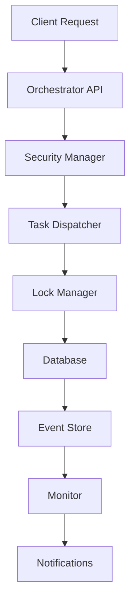
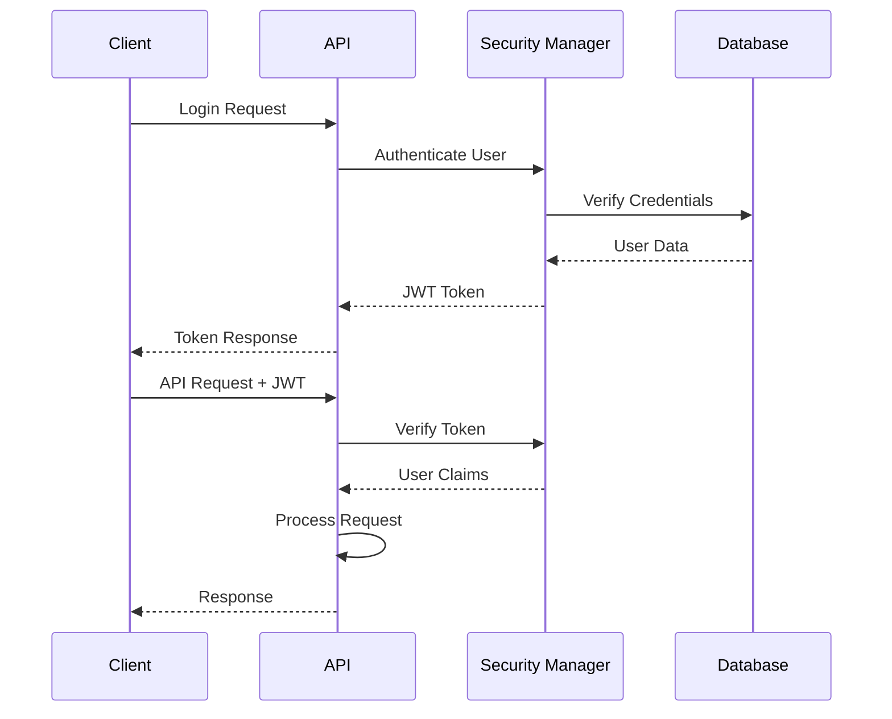
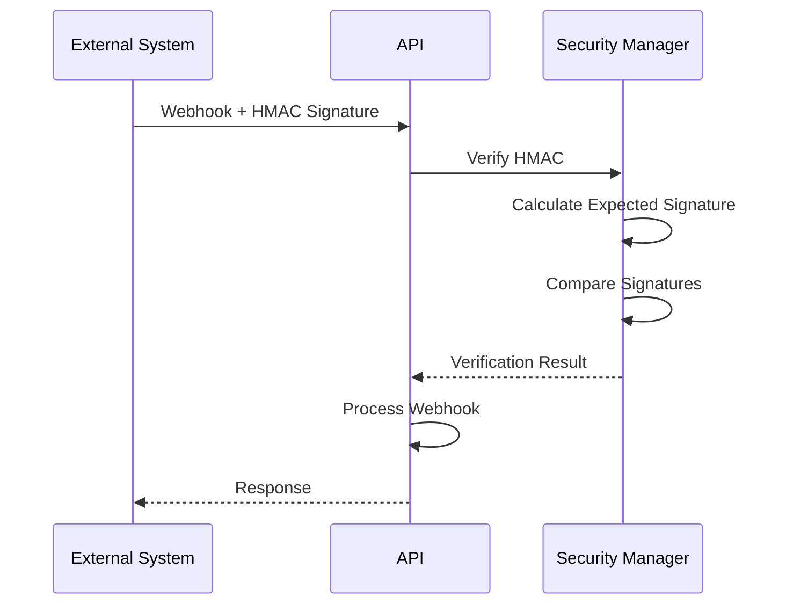

# ORCH-Next Architecture Documentation

## Overview

ORCH-Next is a Python-first orchestration system designed to replace PowerShell-based workflows with a modern, scalable, and observable architecture. The system provides AI-driven monitoring, self-healing capabilities, and comprehensive security features.

## Architecture Principles

### Core Principles
- **Python-First**: All core components implemented in Python with FastAPI
- **Observable**: Comprehensive metrics, logging, and tracing
- **Secure**: JWT authentication, HMAC verification, rate limiting
- **Resilient**: Self-healing, automatic recovery, graceful degradation
- **Scalable**: Async/await, connection pooling, horizontal scaling ready

### Design Patterns
- **Event-Driven**: All state changes generate events
- **Lock-Based Coordination**: SQLite-based distributed locking
- **Metrics-Driven**: Prometheus-compatible metrics for all operations
- **Contract-First**: API contracts with comprehensive testing

## System Components

### 1. Orchestrator API (`src/orchestrator.py`)

**Purpose**: Central API gateway for all orchestration operations

**Key Features**:
- FastAPI-based REST API
- JWT authentication and authorization
- CORS middleware for web clients
- Comprehensive error handling
- Request/response validation with Pydantic

**Endpoints**:
```
GET  /health                    - Health check
GET  /metrics                   - Prometheus metrics
POST /dispatch                  - Dispatch new tasks
POST /webhook                   - Receive webhook notifications
GET  /jobs/{id}/events         - Retrieve job events
PUT  /jobs/{id}/status         - Update job status
GET  /sse/events               - Server-Sent Events stream
```

**Dependencies**:
- SecurityManager for authentication
- TaskDispatcher for task management
- LockManager for coordination
- Monitor for health checks

### 2. Task Dispatcher (`src/dispatcher.py`)

**Purpose**: Core task dispatching and queue management

**Key Features**:
- SQLite-based task persistence
- Priority-based task queuing
- Lock acquisition for task coordination
- Comprehensive metrics collection
- Event logging for all operations

**Database Schema**:
```sql
-- Tasks table
CREATE TABLE tasks (
    task_id TEXT PRIMARY KEY,
    core_id TEXT NOT NULL,
    status TEXT NOT NULL,
    priority INTEGER DEFAULT 1,
    timeout INTEGER DEFAULT 300,
    created_at TIMESTAMP DEFAULT CURRENT_TIMESTAMP,
    updated_at TIMESTAMP DEFAULT CURRENT_TIMESTAMP,
    metadata TEXT,
    result TEXT
);

-- Events table
CREATE TABLE events (
    event_id TEXT PRIMARY KEY,
    task_id TEXT NOT NULL,
    event_type TEXT NOT NULL,
    timestamp TIMESTAMP DEFAULT CURRENT_TIMESTAMP,
    data TEXT,
    FOREIGN KEY (task_id) REFERENCES tasks (task_id)
);
```

**Key Methods**:
- `dispatch_task()`: Create and queue new tasks
- `get_next_task()`: Retrieve next available task
- `update_task_status()`: Update task progress
- `record_event()`: Log task events

### 3. Security Manager (`src/security.py`)

**Purpose**: Authentication, authorization, and security enforcement

**Key Features**:
- JWT token management with configurable expiry
- HMAC signature verification for webhooks
- Rate limiting per user and endpoint
- User management with role-based access
- Security event logging and monitoring

**User Roles**:
```python
class UserRole(Enum):
    ADMIN = "admin"        # Full system access
    OPERATOR = "operator"  # Task management
    VIEWER = "viewer"      # Read-only access
    SYSTEM = "system"      # Internal system operations
```

**Security Features**:
- Password hashing with bcrypt
- JWT tokens with role-based claims
- HMAC-SHA256 webhook verification
- Configurable rate limiting
- Account lockout after failed attempts
- Security event audit trail

### 4. Lock Manager (`src/lock_manager.py`)

**Purpose**: Distributed coordination and resource locking

**Key Features**:
- SQLite-based lock storage
- TTL-based automatic cleanup
- Priority queuing for fair access
- Starvation prevention
- Lock statistics and monitoring

**Lock Schema**:
```sql
CREATE TABLE locks (
    resource TEXT PRIMARY KEY,
    owner TEXT NOT NULL,
    priority INTEGER DEFAULT 1,
    ttl INTEGER NOT NULL,
    acquired_at TIMESTAMP DEFAULT CURRENT_TIMESTAMP,
    expires_at TIMESTAMP NOT NULL
);

CREATE TABLE lock_queue (
    id INTEGER PRIMARY KEY AUTOINCREMENT,
    resource TEXT NOT NULL,
    owner TEXT NOT NULL,
    priority INTEGER DEFAULT 1,
    requested_at TIMESTAMP DEFAULT CURRENT_TIMESTAMP
);
```

**Key Operations**:
- `acquire_lock()`: Acquire resource lock with TTL
- `release_lock()`: Release owned lock
- `extend_lock()`: Extend lock TTL
- `get_lock_info()`: Retrieve lock details
- `list_locks()`: List all active locks

### 5. Monitor Service (`src/monitor.py`)

**Purpose**: AI-driven monitoring and self-healing

**Key Features**:
- System and application metrics collection
- Anomaly detection with EWMA and threshold analysis
- Automated recovery actions (restart, isolate, rollback)
- Slack and webhook notifications
- Configurable monitoring intervals

**Monitoring Metrics**:
- **System**: CPU, memory, disk usage, network I/O
- **Application**: Active connections, request rates, error rates
- **Database**: Connection pool, query performance
- **Locks**: Active locks, queue depth, wait times

**Recovery Actions**:
1. **Restart**: Restart failed services
2. **Isolate**: Remove unhealthy nodes from rotation
3. **Rollback**: Revert to previous stable state
4. **Scale-Up**: Increase resource allocation

## Data Flow Architecture

### Request Flow


### Event Flow


## Database Design

### SQLite Database Structure

**Primary Database**: `data/orch.db`
- Tasks and events
- Users and security events
- Configuration and metadata

**Lock Database**: `data/locks.db` (optional separate database)
- Resource locks
- Lock queue
- Lock statistics

**Metrics Database**: `data/metrics.db`
- Time-series metrics
- Anomaly detection data
- Performance baselines

### Database Connections
- Connection pooling with SQLite
- WAL mode for concurrent access
- Automatic backup and recovery
- Schema migration support

## Security Architecture

### Authentication Flow


### Webhook Security


## Monitoring and Observability

### Metrics Collection

**Prometheus Metrics**:
```
# HTTP Request metrics
orch_http_requests_total{method, status, endpoint}
orch_http_request_duration_seconds{method, endpoint}

# Task metrics
orch_task_duration_seconds{core_id, status}
orch_tasks_total{core_id, status}
orch_task_queue_depth{priority}

# SSE metrics
orch_sse_connections_active
orch_sse_messages_sent_total

# Webhook metrics
orch_webhook_signatures_verified_total{status}
orch_webhook_processing_duration_seconds

# Lock metrics
orch_locks_active{resource_type}
orch_lock_wait_duration_seconds{resource_type}
orch_lock_acquisition_total{resource_type, status}

# System metrics
orch_system_cpu_percent
orch_system_memory_percent
orch_system_disk_usage_bytes{path}
```

### Logging Strategy

**Structured Logging** (JSON format):
```json
{
  "timestamp": "2024-01-15T10:30:00Z",
  "level": "INFO",
  "logger": "orchestrator.api",
  "correlation_id": "req-123e4567-e89b-12d3-a456-426614174000",
  "message": "Task dispatched successfully",
  "task_id": "task-789",
  "core_id": "WORK_AI_01",
  "duration_ms": 45.2,
  "user_id": "user-456"
}
```

**Log Levels**:
- **DEBUG**: Detailed debugging information
- **INFO**: General operational messages
- **WARNING**: Warning conditions
- **ERROR**: Error conditions
- **CRITICAL**: Critical system failures

### Alerting Rules

**Critical Alerts**:
- System CPU > 90% for 5 minutes
- Memory usage > 95% for 2 minutes
- Database connection failures
- Authentication system failures
- Lock acquisition timeouts > 30 seconds

**Warning Alerts**:
- Task queue depth > 100
- Error rate > 5% for 10 minutes
- Response time > 2 seconds (95th percentile)
- Disk usage > 80%

## Deployment Architecture

### Local Development
```
ORCH-Next/
├── src/                    # Application code
├── tests/                  # Test suites
├── data/                   # Local databases
├── logs/                   # Application logs
├── .venv/                  # Python virtual environment
└── requirements.txt        # Dependencies
```

### Production Deployment
```
/opt/orch-next/
├── app/                    # Application code
├── data/                   # Persistent data
├── logs/                   # Log files
├── config/                 # Configuration files
├── backups/                # Database backups
└── scripts/                # Deployment scripts
```

### Container Deployment (Future)
```dockerfile
FROM python:3.11-slim

WORKDIR /app
COPY requirements.txt .
RUN pip install -r requirements.txt

COPY src/ ./src/
COPY config/ ./config/

EXPOSE 8000
CMD ["uvicorn", "src.orchestrator:app", "--host", "0.0.0.0", "--port", "8000"]
```

## Configuration Management

### Configuration Structure
```yaml
# config/production.yaml
database:
  path: "data/orch.db"
  pool_size: 10
  timeout: 30

security:
  jwt_secret: "${JWT_SECRET}"
  jwt_expiry: 3600
  webhook_secret: "${WEBHOOK_SECRET}"
  rate_limit:
    requests_per_minute: 100
    burst_size: 20

monitoring:
  interval: 60
  metrics_retention: 2592000  # 30 days
  alert_thresholds:
    cpu_percent: 80
    memory_percent: 85
    disk_usage_percent: 90

notifications:
  slack:
    webhook_url: "${SLACK_WEBHOOK_URL}"
    channel: "#orch-alerts"
  email:
    smtp_server: "${SMTP_SERVER}"
    from_address: "orch@company.com"
```

### Environment Variables
```bash
# Security
JWT_SECRET=your-jwt-secret-key
WEBHOOK_SECRET=your-webhook-secret-key

# Database
DATABASE_URL=sqlite:///data/orch.db

# Monitoring
SLACK_WEBHOOK_URL=https://hooks.slack.com/services/...
SMTP_SERVER=smtp.company.com

# Feature Flags
ENABLE_MONITORING=true
ENABLE_SELF_HEALING=true
DEBUG_MODE=false
```

## API Specifications

### Task Dispatch API

**Endpoint**: `POST /dispatch`

**Request**:
```json
{
  "coreId": "WORK_AI_01",
  "stay": false,
  "priority": 2,
  "timeout": 300,
  "metadata": {
    "source": "api",
    "user_id": "user-123",
    "tags": ["urgent", "production"]
  }
}
```

**Response**:
```json
{
  "task_id": "task-123e4567-e89b-12d3-a456-426614174000",
  "status": "queued",
  "core_id": "WORK_AI_01",
  "priority": 2,
  "created_at": "2024-01-15T10:30:00Z",
  "estimated_start": "2024-01-15T10:31:00Z"
}
```

### Webhook API

**Endpoint**: `POST /webhook`

**Headers**:
```
Content-Type: application/json
X-Signature: t=1642248600,v1=sha256_signature
```

**Request**:
```json
{
  "event": "task.completed",
  "task_id": "task-123",
  "core_id": "WORK_AI_01",
  "status": "success",
  "timestamp": 1642248600,
  "data": {
    "duration": 123.45,
    "output": "Task completed successfully",
    "metrics": {
      "cpu_usage": 45.2,
      "memory_usage": 67.8
    }
  }
}
```

### Metrics API

**Endpoint**: `GET /metrics`

**Response** (Prometheus format):
```
# HELP orch_http_requests_total Total HTTP requests
# TYPE orch_http_requests_total counter
orch_http_requests_total{method="POST",status="200",endpoint="/dispatch"} 1234

# HELP orch_task_duration_seconds Task execution duration
# TYPE orch_task_duration_seconds histogram
orch_task_duration_seconds_bucket{core_id="WORK_AI_01",le="1.0"} 100
orch_task_duration_seconds_bucket{core_id="WORK_AI_01",le="5.0"} 200
orch_task_duration_seconds_bucket{core_id="WORK_AI_01",le="+Inf"} 250
orch_task_duration_seconds_sum{core_id="WORK_AI_01"} 567.89
orch_task_duration_seconds_count{core_id="WORK_AI_01"} 250
```

## Testing Strategy

### Test Pyramid
```
    /\
   /  \     E2E Tests (10%)
  /____\    Integration Tests (20%)
 /      \   Unit Tests (70%)
/__________\
```

### Test Categories

**Unit Tests** (`tests/test_*.py`):
- Individual component testing
- Mock external dependencies
- Fast execution (< 1 second per test)
- High coverage (> 90%)

**Integration Tests** (`tests/integration/`):
- Component interaction testing
- Real database connections
- API endpoint testing
- Medium execution time (< 10 seconds per test)

**Contract Tests** (`tests/contract/`):
- API contract verification
- HMAC signature validation
- JWT token verification
- Cross-service compatibility

**Load Tests** (`tests/load/`):
- Performance under load
- SSE connection scaling
- Database performance
- Memory and CPU usage

**End-to-End Tests** (`tests/e2e/`):
- Complete workflow testing
- Real external dependencies
- User journey validation
- Slow execution (minutes)

### Test Configuration

**pytest.ini**:
```ini
[tool:pytest]
testpaths = tests
python_files = test_*.py
python_classes = Test*
python_functions = test_*
addopts = --strict-markers --strict-config --cov=src --cov-report=xml
markers =
    unit: Unit tests
    integration: Integration tests
    e2e: End-to-end tests
    slow: Slow running tests
    security: Security tests
    performance: Performance tests
    contract: Contract tests
```

## Performance Requirements

### Response Time Targets
- **API Endpoints**: < 200ms (95th percentile)
- **Task Dispatch**: < 500ms (95th percentile)
- **Webhook Processing**: < 100ms (95th percentile)
- **Metrics Collection**: < 50ms (95th percentile)

### Throughput Targets
- **HTTP Requests**: 1000 requests/second
- **Task Dispatch**: 100 tasks/second
- **SSE Connections**: 500 concurrent connections
- **Webhook Events**: 200 events/second

### Resource Limits
- **Memory Usage**: < 512MB baseline, < 1GB under load
- **CPU Usage**: < 50% baseline, < 80% under load
- **Database Size**: < 10GB for 1 million tasks
- **Log File Size**: < 100MB per day

## Operational Procedures

### Startup Sequence
1. Load configuration from environment and files
2. Initialize database connections and schema
3. Start background services (monitor, cleanup)
4. Initialize security manager and load users
5. Start FastAPI application server
6. Register health check endpoints
7. Begin accepting requests

### Shutdown Sequence
1. Stop accepting new requests
2. Complete in-flight requests (graceful timeout: 30s)
3. Stop background services
4. Flush logs and metrics
5. Close database connections
6. Exit process

### Health Checks
```python
# Health check endpoint response
{
  "status": "healthy",
  "timestamp": "2024-01-15T10:30:00Z",
  "version": "1.0.0",
  "components": {
    "database": "healthy",
    "lock_manager": "healthy",
    "monitor": "healthy",
    "security": "healthy"
  },
  "metrics": {
    "uptime_seconds": 3600,
    "total_requests": 12345,
    "active_tasks": 5,
    "active_locks": 2
  }
}
```

### Backup Procedures
1. **Database Backup**: Daily SQLite backup to `data/backups/`
2. **Configuration Backup**: Version controlled in Git
3. **Log Archival**: Weekly log rotation and compression
4. **Metrics Export**: Daily Prometheus metrics export

### Recovery Procedures
1. **Database Recovery**: Restore from latest backup
2. **Configuration Recovery**: Git checkout to stable version
3. **Service Recovery**: Restart with health checks
4. **Data Validation**: Verify data integrity post-recovery

## Migration Guide

### From PowerShell to Python

**PowerShell Script Migration**:
```powershell
# Old PowerShell approach
.\Task-Dispatcher.ps1 -Action Dispatch -CoreId "WORK_AI_01" -Stay
```

**New Python API**:
```python
# New Python approach
import httpx

response = httpx.post("http://localhost:8000/dispatch", json={
    "coreId": "WORK_AI_01",
    "stay": True,
    "priority": 1
})
```

**Migration Steps**:
1. Identify PowerShell scripts to migrate
2. Map PowerShell parameters to API requests
3. Update calling code to use HTTP API
4. Test functionality equivalence
5. Remove PowerShell scripts
6. Update documentation

### Database Migration
```python
# Migration script example
def migrate_v1_to_v2():
    """Migrate database schema from v1 to v2"""
    with sqlite3.connect("data/orch.db") as conn:
        # Add new columns
        conn.execute("ALTER TABLE tasks ADD COLUMN metadata TEXT")
        conn.execute("ALTER TABLE tasks ADD COLUMN result TEXT")
        
        # Create new tables
        conn.execute("""
            CREATE TABLE events (
                event_id TEXT PRIMARY KEY,
                task_id TEXT NOT NULL,
                event_type TEXT NOT NULL,
                timestamp TIMESTAMP DEFAULT CURRENT_TIMESTAMP,
                data TEXT,
                FOREIGN KEY (task_id) REFERENCES tasks (task_id)
            )
        """)
        
        # Update schema version
        conn.execute("PRAGMA user_version = 2")
```

## Future Enhancements

### Planned Features
1. **Go SSE Gateway**: High-performance SSE handling
2. **Redis Integration**: Distributed caching and pub/sub
3. **PostgreSQL Support**: Production database option
4. **Kubernetes Deployment**: Container orchestration
5. **GraphQL API**: Advanced query capabilities
6. **Machine Learning**: Predictive scaling and optimization

### Scalability Roadmap
1. **Phase 1**: Single-node optimization (current)
2. **Phase 2**: Multi-node coordination
3. **Phase 3**: Auto-scaling and load balancing
4. **Phase 4**: Global distribution and edge deployment

### Technology Evolution
- **Python 3.12+**: Latest language features
- **FastAPI 0.100+**: Enhanced performance
- **SQLite 3.45+**: Improved concurrent access
- **Prometheus 2.50+**: Advanced metrics
- **Grafana 10.0+**: Enhanced visualization

---

This architecture documentation provides a comprehensive overview of the ORCH-Next system. For specific implementation details, refer to the source code and additional technical documentation.