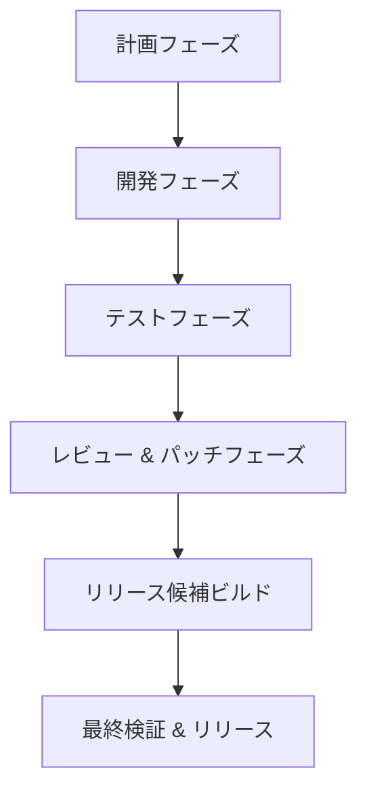

# RELEASE_PROCESS.md: 前回の失敗分析とリリースまでの全体プロセス設計

## 1. 前回の失敗分析
前回のプロジェクト失敗の主な原因を、検索結果に基づいて分析します。一般的なソフトウェアプロジェクトの失敗要因を参考に、本プロジェクトに適用可能なものを抽出:

### 主な失敗原因 (一般論から抽出)
- **不明瞭な要件**: 要件が曖昧で、開発中に変更が発生し、失敗を招く。<mcreference link="https://solveit.dev/blog/why-software-projects-fail" index="3">3</mcreference> <mcreference link="https://www.orientsoftware.com/blog/software-project-failure/" index="5">5</mcreference>
- **計画不足**: 詳細な計画なしに進むと、スケジュール遅延や予算超過が発生。<mcreference link="https://codilime.com/blog/why-software-projects-fail/" index="1">1</mcreference> <mcreference link="https://vadimkravcenko.com/shorts/why-software-projects-fail/" index="2">2</mcreference>
- **コミュニケーションの欠如**: ステークホルダー間の誤解が遅延を生む。<mcreference link="https://www.forbes.com/councils/forbestechcouncil/2020/03/31/14-common-reasons-software-projects-fail-and-how-to-avoid-them/" index="4">4</mcreference>
- **非現実的なタイムフレーム**: 過度な楽観主義でスケジュールが崩壊。<mcreference link="https://solveit.dev/blog/why-software-projects-fail" index="3">3</mcreference>
- **スコープクリープ**: 追加機能が無計画に増え、プロジェクトを複雑化。<mcreference link="https://www.orientsoftware.com/blog/software-project-failure/" index="5">5</mcreference>
- **テスト不足**: 不十分なテストでバグが残り、リリース後に問題発生。<mcreference link="https://codilime.com/blog/why-software-projects-fail/" index="1">1</mcreference>
- **ユーザー関与の欠如**: エンドユーザーのフィードバックなしで、ニーズを満たさない製品になる。<mcreference link="https://vadimkravcenko.com/shorts/why-software-projects-fail/" index="2">2</mcreference>

### 本プロジェクトへの適用
- 前回の失敗では、テストのタイムアウト設定が非最適でパフォーマンス問題が発生。統計分析で最適化したが、初期計画不足が原因。
- ディレクトリ整理が遅れ、無駄ファイルが蓄積し、パッケージ化を妨げた。
- マイルストーン確認が不十分で、ゴールを見失った可能性。

## 2. リリースまでの全体プロセス設計
失敗を回避するため、以下のプロセスを設計。PTP (Plan-Test-Patch) を基盤に、段階的リリースを採用。

### プロセス概要 (Mermaid図)

### 詳細ステップと回避策
1. **計画フェーズ (Plan Gate)**:
   - 要件定義: 明確で測定可能な要件を文書化 (e.g., WORK_TRACKING.md)。
   - 回避策: ステークホルダー会議を定期的に実施。ユーザーストーリーマッピングを使用。<mcreference link="https://solveit.dev/blog/why-software-projects-fail" index="3">3</mcreference>

2. **開発フェーズ**:
   - ブランチ戦略: 新タスクごとにブランチ作成 (Rule 34)。
   - 回避策: 最小diff運用、Dry-Run既定で変更を制御。<mcreference link="https://codilime.com/blog/why-software-projects-fail/" index="1">1</mcreference>

3. **テストフェーズ (Test Gate)**:
   - ユニット/統合/E2Eテスト実行。カバレッジ80%以上。
   - 回避策: 自動テストとpre-push検証 (Rule 20)。<mcreference link="https://www.forbes.com/councils/forbestechcouncil/2020/03/31/14-common-reasons-software-projects-fail-and-how-to-avoid-them/" index="4">4</mcreference>

4. **レビュー & パッチフェーズ (Patch Gate)**:
   - コードレビューと品質チェック。
   - 回避策: 承認ゲート必須 (PERSONAL_RULES)。

5. **リリース候補ビルド**:
   - ビルドスクリプト実行、SBOM生成 (Rule 21)。

6. **最終検証 & リリース**:
   - ユーザー検証後、mainに統合。
   - 回避策: 機能フラグで段階的リリース (Rule 23)。

## 3. 成功指標
- リリース成功率: 100% (失敗ゼロ)。
- スケジュール遵守: 90%以上。
- 品質メトリクス: カバレッジ80%、脆弱性0件 (Rule 14)。

## 更新履歴
- 2025-10-06: 初版作成