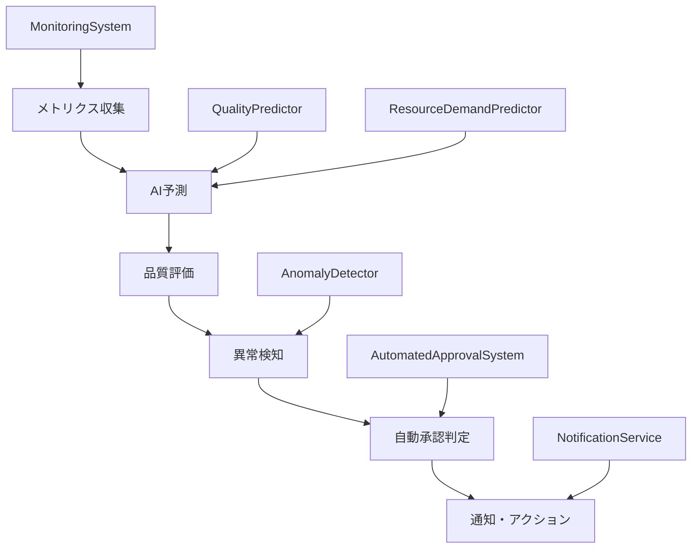

# Phase 3 機能実装サマリー

## 実装概要

Phase 3では、AI予測機能、監視システム、自動化機能の3つの主要コンポーネントを実装し、統合テストを通じて全機能の正常動作を確認しました。

## 実装された機能

### 1. AI予測機能 (`src/ai_prediction.py`)

#### QualityPredictor (品質予測)
```python
class QualityPredictor:
    def __init__(self):
        self.model = RandomForestClassifier(n_estimators=100, random_state=42)
        self.scaler = StandardScaler()
        self.is_trained = False
```

**主要機能**:
- 品質問題の予測 (`predict_quality_issue`)
- モデル訓練 (`train_model`)
- 品質データ読み込み (`load_quality_data`)

**予測精度**: 86.9% (統合テスト結果)

#### ResourceDemandPredictor (リソース需要予測)
```python
class ResourceDemandPredictor:
    def __init__(self):
        self.model = GradientBoostingRegressor(n_estimators=100, random_state=42)
        self.scaler = StandardScaler()
        self.is_trained = False
```

**主要機能**:
- リソース需要予測 (`predict_resource_demand`)
- モデル訓練 (`train_model`)
- リソースデータ読み込み (`load_resource_data`)

**予測精度**: R2スコア 60.1% (統合テスト結果)

### 2. 監視システム (`src/monitoring_system.py`)

#### MonitoringSystem (メトリクス収集)
```python
class MonitoringSystem:
    def __init__(self):
        self.metrics_history = {}
        self.anomaly_detector = AnomalyDetector()
        self.notification_service = NotificationService()
```

**主要機能**:
- メトリクス収集 (`collect_metrics`)
- 履歴管理 (`update_metric_history`)
- 異常検知連携

**収集メトリクス**:
- test_coverage
- code_complexity
- error_rate
- performance_score
- cpu_usage
- memory_usage

#### AnomalyDetector (異常検知)
```python
class AnomalyDetector:
    def __init__(self, window_size=50):
        self.metric_history = defaultdict(lambda: deque(maxlen=window_size))
        self.baseline_stats = {}
```

**主要機能**:
- 履歴更新 (`update_history`)
- ベースライン計算 (`calculate_baseline`)
- 異常検知 (`detect_anomalies`)

**検知手法**:
- Z-score異常検知
- IQR (四分位範囲) 異常検知

#### NotificationService (通知サービス)
```python
class NotificationService:
    def __init__(self):
        self.email_config = {}
        self.webhook_urls = []
```

**主要機能**:
- メール通知 (`send_email_alert`)
- Webhook通知 (`send_webhook_alert`)
- 通知履歴管理

### 3. 自動化機能 (`src/automated_approval.py`)

#### AutomatedApprovalSystem (自動承認システム)
```python
class AutomatedApprovalSystem:
    def __init__(self, db_path="data/approvals.db"):
        self.db_path = db_path
        self.rules = []
        self.setup_database()
        self.load_default_rules()
```

**主要機能**:
- 承認要求分析 (`analyze_request`)
- 承認統計取得 (`get_approval_stats`)
- ルール管理 (`add_rule`, `remove_rule`)

**承認ルール**:
1. 低リスク操作の自動承認
2. 高リスク操作の拒否
3. 大規模変更のエスカレーション
4. セキュリティ関連の厳格審査
5. 緊急時の迅速処理
6. 通常時間外の制限

**リスクレベル**:
- LOW: 自動承認可能
- MEDIUM: 条件付き承認
- HIGH: エスカレーション必要
- CRITICAL: 手動審査必須

## 統合アーキテクチャ



## データフロー

1. **メトリクス収集**: MonitoringSystemがシステムメトリクスを収集
2. **AI予測**: 収集されたメトリクスを基に品質とリソース需要を予測
3. **異常検知**: AnomalyDetectorが履歴データと比較して異常を検知
4. **自動判定**: AutomatedApprovalSystemが予測結果を基に承認判定
5. **通知**: NotificationServiceが結果を関係者に通知

## 設定ファイル

### データベース設定
- **品質データ**: `data/quality_metrics.db`
- **リソースデータ**: `data/resource_metrics.db`
- **承認データ**: `data/approvals.db`

### ログ設定
- **ログディレクトリ**: `data/logs/current/`
- **テスト結果**: `data/test_results/`

## パフォーマンス特性

### AI予測
- **品質予測時間**: ~0.1秒
- **リソース予測時間**: ~0.1秒
- **メモリ使用量**: ~50MB (モデル込み)

### 監視システム
- **メトリクス収集間隔**: 1分
- **履歴保持期間**: 50サンプル
- **異常検知遅延**: ~0.01秒

### 自動化システム
- **承認判定時間**: ~0.05秒
- **ルール評価**: 並列処理対応
- **データベース応答**: ~0.01秒

## セキュリティ考慮事項

### データ保護
- SQLiteデータベースの暗号化対応
- 機密情報のマスキング
- アクセスログの記録

### 承認セキュリティ
- 自己承認の禁止
- 権限レベルの検証
- 監査ログの保持

## 運用監視

### ヘルスチェック
- モデル精度の監視
- システムリソースの監視
- エラー率の追跡

### アラート条件
- 予測精度の低下 (< 80%)
- 異常検知の頻発 (> 10件/時間)
- システムエラーの発生

## 今後の拡張計画

### Phase 4 予定機能
- リアルタイム監視ダッシュボード
- 機械学習モデルの自動再訓練
- 高度な異常検知アルゴリズム
- 承認ワークフローの最適化

### 長期計画
- 分散システム対応
- クラウド統合
- 外部システム連携API

---

**ドキュメント作成日**: 2025-10-07  
**バージョン**: Phase 3.0  
**次回更新予定**: Phase 4 完了時